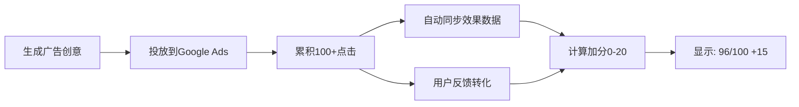

# Bonus Score System Implementation Summary

## Implementation Date: 2025-11-23

## ✅ Phase 1 Complete - Core System (Day 1)

### 1. Database Schema (Migration 020 & 021)
**Files**:
- `scripts/migrations/020_create_bonus_score_tables.sql`
- `scripts/migrations/021_add_offers_industry_code.sql`

Created 4 new tables + 1 field:
- ✅ `industry_benchmarks` - 30 二级行业基准数据
- ✅ `ad_creative_performance` - 广告创意效果数据
- ✅ `conversion_feedback` - 用户转化反馈
- ✅ `score_analysis_history` - 评分分析历史
- ✅ `offers.industry_code` - Offer行业分类字段

### 2. Industry Classifier Service
**File**: `src/lib/industry-classifier.ts`

Features:
- ✅ 关键词匹配自动分类 Offer 到 30 个二级行业
- ✅ 获取所有行业基准数据
- ✅ 分组选项支持 (用于 UI 下拉)
- ✅ 置信度计算

### 3. Bonus Score Calculator
**File**: `src/lib/bonus-score-calculator.ts`

Features:
- ✅ 20分加分计算 (4指标 × 5分)
- ✅ 最低100点击门槛验证
- ✅ 与行业基准比较
- ✅ 存储和检索效果数据
- ✅ 用户统计分析

Scoring Logic:
| Metric | Scoring Criteria |
|--------|------------------|
| Clicks | 1000+ = 5分, 500+ = 4分, 300+ = 3分, 200+ = 2分, else = 1分 |
| CTR | ≥1.5x基准 = 5分, ≥1.2x = 4分, ≥0.9x = 3分, ≥0.7x = 2分, else = 1分 |
| CPC | ≤0.5x基准 = 5分, ≤0.7x = 4分, ≤1.0x = 3分, ≤1.3x = 2分, else = 1分 |
| Conv. | ≥1.5x基准 = 5分, ≥1.2x = 4分, ≥0.9x = 3分, ≥0.7x = 2分, else = 1分 |

### 4. API Endpoints

**Conversion Feedback API**
- ✅ `POST /api/ad-creatives/[id]/conversion-feedback` - 提交转化数据
- ✅ `GET /api/ad-creatives/[id]/conversion-feedback` - 获取转化历史

**Bonus Score API**
- ✅ `GET /api/ad-creatives/[id]/bonus-score` - 获取加分数据

**Performance Sync API**
- ✅ `POST/GET /api/sync-performance` - 同步Google Ads效果数据

### 5. UI Components

**BonusScoreCard**
- ✅ File: `src/components/BonusScoreCard.tsx`
- ✅ 显示格式: "96/100 + 20"
- ✅ 四项指标明细 (Clicks, CTR, CPC, Conversions)
- ✅ 行业标签
- ✅ Tooltip 显示基准对比
- ✅ 颜色编码 (excellent/good/average/below/low)

**ConversionFeedbackForm**
- ✅ File: `src/components/ConversionFeedbackForm.tsx`
- ✅ 用户手动输入转化数据
- ✅ 日期范围选择
- ✅ 转化价值 (可选)
- ✅ 备注字段
- ✅ 表单验证

### 6. Page Integration

**Step1 Creative Generation**
- ✅ File: `src/app/(app)/offers/[id]/launch/steps/Step1CreativeGeneration.tsx`
- ✅ BonusScoreCard显示在雷达图下方
- ✅ 点击[Add]按钮打开转化反馈表单
- ✅ 提交成功后自动刷新加分数据

### 7. Performance Sync Service

**Google Ads Sync**
- ✅ File: `src/lib/google-ads-performance-sync.ts`
- ✅ 自动同步clicks, CTR, CPC from Google Ads API
- ✅ 批量同步所有活跃创意
- ✅ 错误处理和日志记录

## Industry Benchmarks (30 Categories)

| L1 Category | L2 Categories | Count |
|-------------|---------------|-------|
| E-commerce | Fashion, Electronics, Home, Beauty, Sports, Food | 6 |
| Travel | Luggage, Hotels, Flights, Tours | 4 |
| Technology | SaaS, Consumer, B2B, Apps | 4 |
| Finance | Banking, Insurance, Investment, Crypto | 4 |
| Education | Online, Academic, Professional | 3 |
| Healthcare | Medical, Pharma, Wellness | 3 |
| Automotive | Sales, Parts | 2 |
| Real Estate | Residential, Commercial | 2 |
| Entertainment | Gaming, Media | 2 |
| **Total** | **30 industries** | **30** |

## Display Format Example

```
┌─────────────────────────────┐
│ Performance Score           │
│ E-commerce > Fashion        │
├─────────────────────────────┤
│      96/100 +15             │
│    Total: 111/120           │
├─────────────────────────────┤
│ 👆 Clicks       1,234  +5   │
│ 🎯 CTR          3.2%   +4   │
│ 💲 CPC          $0.35  +3   │
│ 🛒 Conv.        2.8%   +3 [Add] │
└─────────────────────────────┘
```

## Usage Flow



## Files Created

```
Database:
  scripts/migrations/020_create_bonus_score_tables.sql
  scripts/migrations/021_add_offers_industry_code.sql

Services:
  src/lib/industry-classifier.ts
  src/lib/bonus-score-calculator.ts
  src/lib/google-ads-performance-sync.ts

APIs:
  src/app/api/ad-creatives/[id]/conversion-feedback/route.ts
  src/app/api/ad-creatives/[id]/bonus-score/route.ts
  src/app/api/sync-performance/route.ts

Components:
  src/components/BonusScoreCard.tsx
  src/components/ConversionFeedbackForm.tsx

Documentation:
  claudedocs/BONUS_SCORE_IMPLEMENTATION_2025-11-23.md
```

## 🚧 Future Enhancements (Phase 2+)

### Automation
- [ ] Cron job for daily Google Ads sync
- [ ] Automatic industry classification on offer creation
- [ ] Email notifications for milestone achievements

### Analysis
- [ ] Correlation analysis (score vs performance)
- [ ] A/B testing insights
- [ ] Performance trend charts
- [ ] Optimization recommendations

### UI Enhancements
- [ ] Industry selector on offer creation
- [ ] Bonus score leaderboard
- [ ] Performance comparison view
- [ ] Historical score tracking

## Integration Checklist

### For Developers
- [x] Database migrations applied
- [x] Industry benchmarks seeded (30 rows)
- [x] API endpoints tested
- [x] UI components integrated
- [ ] User authentication integrated (currently using temp userId)
- [ ] Google Ads API credentials configured
- [ ] Production environment variables set

### For Users
- [x] View bonus score on creative detail
- [x] Submit conversion feedback
- [x] See performance breakdown
- [ ] Trigger manual sync
- [ ] View optimization insights

## Next Steps

1. **User Authentication Integration**
   - Replace "user_temp" with actual user ID from session
   - Add auth middleware to sync API

2. **Google Ads API Setup**
   - Configure OAuth2 credentials
   - Add refresh token management
   - Test sync with real campaigns

3. **Cron Job Setup**
   - Create daily sync schedule
   - Add error notification system
   - Monitor sync health

4. **Testing**
   - End-to-end testing with real data
   - Edge case handling (no data, API failures)
   - Performance optimization

## Technical Notes

### Performance Considerations
- Bonus score calculation is cached in database
- Only recalculated when new feedback submitted or data synced
- Minimum 100 clicks threshold prevents premature scoring

### Data Privacy
- All performance data scoped by user_id
- Industry benchmarks are aggregated public data
- Conversion data user-submitted, not tracked

### Scalability
- Industry classifier uses keyword matching (fast, no AI)
- Bonus score calculation is O(1) per creative
- Batch sync optimized for 100s of creatives
